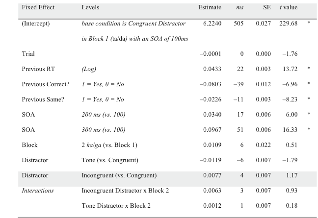

##### Badania, ukazują że fonetyczne cechy mowy i szybko wypowiadania mogą być modulowane przez wiele bodźców, które docierają do mówcy.
Schrefiers, Meyer, Levelt (1990) wskazują, że szybkość reakcji (podanie nazwy przedmiotu z ilustracji) zwiększa się jeśli słyszą dystraktor, który rymuję się z daną nazwą. Badania Galantucci et al. (2009) ukazują, że kszas reakcji odnosi się do efektu percepcyjno-motorycznego, ponieważ jest współzależne z procesem przygotowania wypowiedzi. 

# Eksperyment 1 - Efekt dźwiękowy

## Materiał i metody

* 38 uczestników 
* native speakerzy (american english)
* Nie mają niepełnosprawności związanych z wymową i słuchem
* 12 mężczyzn, 26 kobiet

## Procedura

## Wyniki
 

----

# Eksperyment 2 - efekt artykulatora

## Metoda

## Uczestnicy badania

* 35 uczestników
* 28 kobiet i 7 mężczyzn

## Przebieg badania

## Bodźce

# Dyskusja

##Dyskusja

* Wyniki eksperymentów potwierdzają, że jeśli reakcja i dystraktory są podobne (nie na poziomie fonetycznym) to wpływa to na czas rekacji 
* Badanie ukazuje, że krótszy czas reakcji wiążę się z użyciem dystraktora o podobnym sposobie artykulacji
* Kody aktywowane w procesie planowania odpowiedzi są również aktywowane automatycznie w trakcie postrzegania dystraktora

